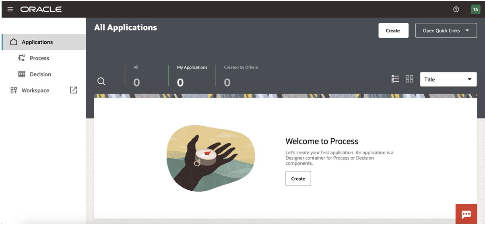
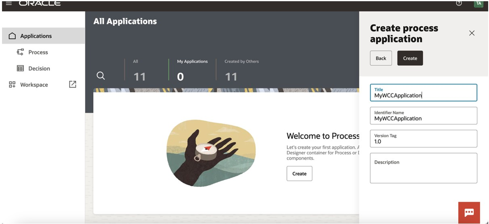
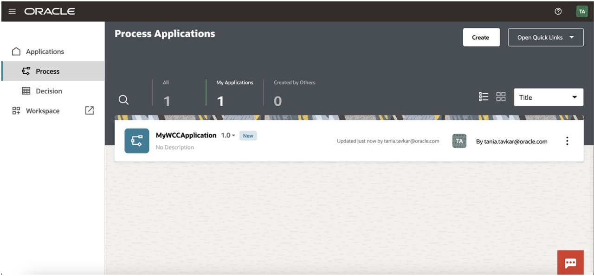
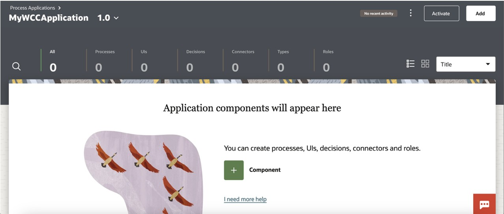
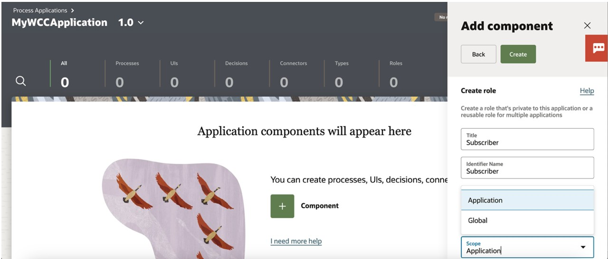
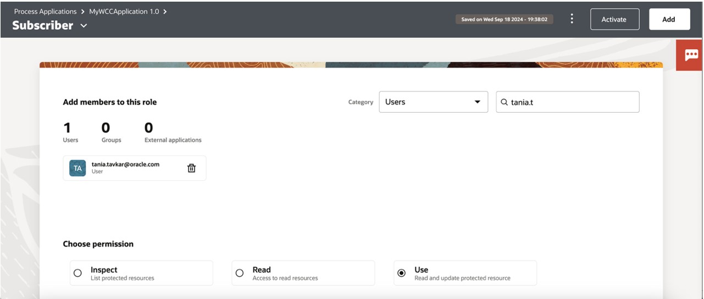

# Integrating WebCenter Content Public Links with Oracle Process Automation Using REST APIs

## Introduction

This Lab walks you through a scenario demonstrating how to use Oracle WebCenter Content (WCC) REST APIs to build an automated document-driven workflow in Oracle Process Automation (OPA).
Participants will learn how to programmatically generate and share public document links, receive external submissions, and automatically route them through approval processes—while storing and managing all content centrally in WebCenter Content.

**Estimated Lab Time**: *30 minutes*

### Objectives

* Create an OPA application
* Create node JS proxy server

### Prerequisites

This lab assumes you have:

* Access to WCC
* Access to OPA.

## Task 1: Create OPA application

1. Create a Process Application in Designer
  

2. Click Create. The Create Application side pane opens.

   In the **Title** field, enter *Subscription Application*. Enter a meaningful description in the **Description** field. Leave the Version Tag field as **1.0**

        <copy>Subscription Application</copy>

  
3. Click **Create** button.

  
4. A message indicates that it’s being created, then shows a link. Click the Open now link in the message. 

  
5. Create Roles.

* From the top of the page, click Add.

* In the Add component pane, expand Roles, and click New.

* In the Title field, enter Subscriber, and click Create.
      

* Click the **Open** now link or select the role from the Roles page to open it.

* Let’s assign a user and review permissions for the role. In the **Search by** fields:

      * Leave **Users** selected in the drop-down field.
      * In the **Search**  field, enter the first few characters of the user name you signed in with.
      * Select the user. The user gets listed in the page.

* In the **Application Permission Level** options, leave **Use** selected. This allows your user to start an application request in Workspace.
   

## Acknowledgements

* **Authors-** Tania Tavkar -  Principal Solution Engineer - Cloud Adoption | Oracle WebCenter
* **Contributors-** Senthilkumar Chinnappa, Mandar Tengse , Parikshit Khisty
* **Last Updated By/Date-** Senthilkumar Chinnappa, December 2024
