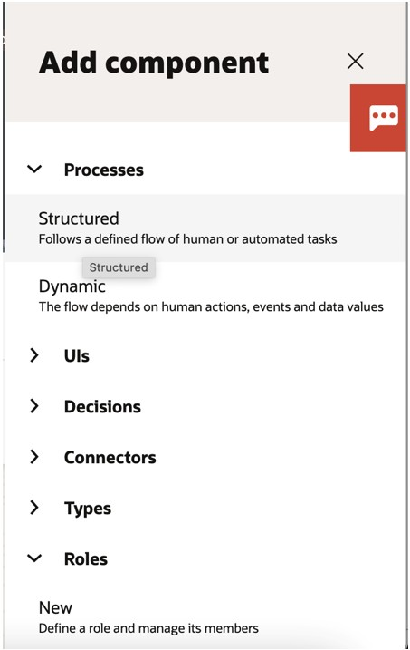
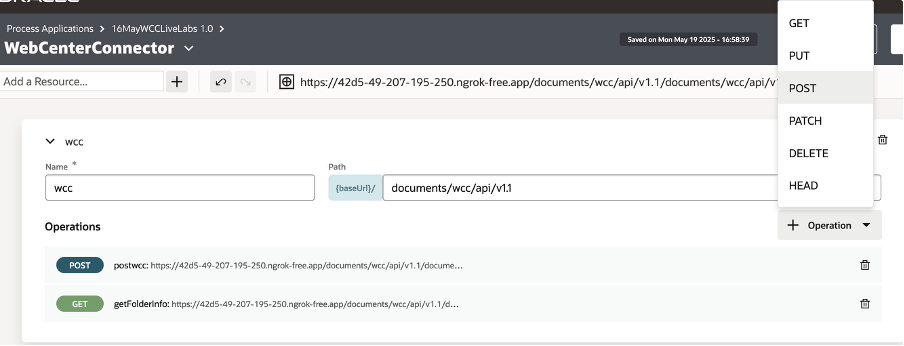
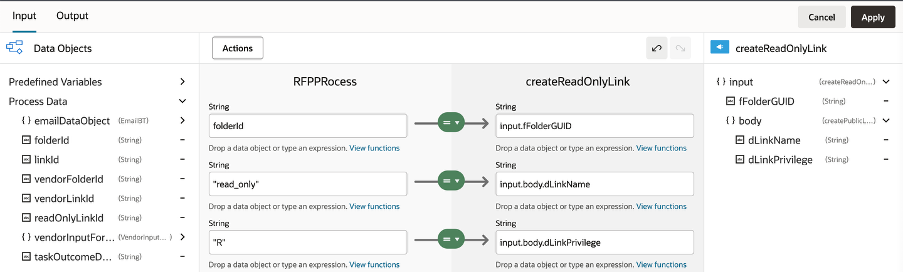
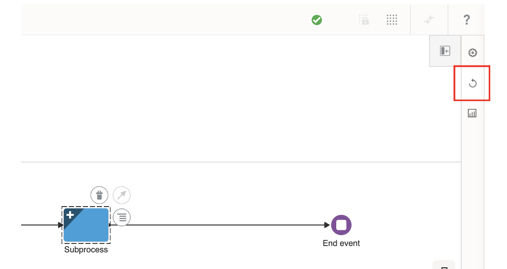

# Integrating WebCenter Content with Oracle Process Automation Using REST APIs

## Introduction

This Lab walks you through a scenario demonstrating how to use Oracle WebCenter Content (WCC) REST APIs to build an automated document-driven workflow in Oracle Process Automation (OPA).

Participants will learn how to programmatically generate and share public document links, receive external submissions, and automatically route them through approval processes—while storing and managing all content centrally in WebCenter Content.

**Estimated Lab Time**: *30 minutes*

### Objectives

* Create an OPA application
* Create node JS proxy server

### Prerequisites

This lab assumes you have:

* Access to WCC
* Access to OPA.

## Task 1: Create a Process Application

1. On the Designer home page (All Applications), click the Create button on top right of the page.
  

2. The Create Application side pane opens.

   In the **Title** field, enter *Subscription Application*. Enter a meaningful description in the **Description** field. Leave the Version Tag field as **1.0**

        <copy>Subscription Application</copy>

  
3. Click **Create** button.

  
4. A message indicates that it’s being created, then shows a link. Click the Open now link in the message.

  
5. Create Roles

* From the top of the page, click Add.

* In the Add component pane, expand Roles, and click New.

* In the Title field, enter Subscriber, and click Create.
      

* Click the **Open** now link or select the role from the Roles page to open it.

* Let’s assign a user and review permissions for the role. In the **Search by** fields:

      * Leave **Users** selected in the drop-down field.
      * In the **Search**  field, enter the first few characters of the user name you signed in with.
      * Select the user. The user gets listed in the page.

* In the **Application Permission Level** options, leave **Use** selected. This allows your user to start an application request in Workspace.
   

* Repeat steps 1 - 4 to create the second role, only this time enter its name as Approver in the Title field.
   

* Repeat step 5 and 6 to assign a user for the Approver role and set permission.

## Task 2: Design a Structured Process

   1. Create Process

      * Click the **Subscription Application 1.0** breadcrumb to go to your application’s main page.*

      * From the top of the page, click **Add**.

      * In the Add component pane, expand **Processes**, and click **Structured**.
         

      * Enter *RFPProcess* in the **Title** field. Click **Create**. A confirmation message shows that the process was created.

         

      * Select the process to open it. The structured process editor opens. Start and end elements are already positioned on the flow for you. There are two swim lanes and the BPMN elements palette is on the right side.
         

      * Select the first swimlane containing the start and end element by clicking the bar on the left of the canvas.
         

      * Click the edit icon to open the Properties pane. In the Properties pane, select Subscriber in the Role drop-down field.
         

      * Click on start event and click the edit icon. Select Open Properties. Enter the title “Start RFP bid” in Title field
         

   2. Create Simple Data Objects
      1. Open the RFPPRocess process, and then click Data icon on the right.
         

      2. In the Data pane, click Create Data Object
         

      3. In the resulting Create Data Object pane, enter *folderId* in the Name field.

      4. Under Data Type , select Simple.

      5. Click Create.
         

      6. Similarly repeat steps 1-5 to create below data objects.

         | **Name**                  | **Data Type**   |
         |---------------------------|-----------------|
         | folderId                  | String          |
         | linkId                    | String          |
         | vendorFolderId            | String          |
         | publicLinkforVendorFolder | String          |
         | vendorLinkId              | String          |
         | readOnlyLinkId            | String          |

   3. Create Business Type
      1. Click on Add. Select Business Type
        

      2. Add Title as *EmailBT* and click Create. Click Open Now once created.
        

      3. Click Add New to add Attributes. Type *email_Id* in Name field. String in Type and Select “Make it an array”
        

      4. Now, open the  RFPPRocess process, and click Data. In the Data pane, click Create Data Object
        

      5. In Name field enter *emailDataObject* and Data Type as Business. Select EmailBT from dropdown.
        

   4. Create UI
      1. Click Add at the top of the page. In the Add component pane, expand UIs and click Web Form
         

      2. In the Title field, enter *RFPInitiationForm*
         

      3. Click Create, then click the Open now link.

      4. Drag and drop InputText onto the canvas.
         

      5. Change its label from InputText to *Project Name*
         

      6. Change the Name in the properties field to *projectName*
         

      7. Similarly drag another Input Text control onto the canvas and label it *Project Manager Email*
         

      8. Change the name in properties window to *projectManagerEmail*
         

      9. Add another control to the canvas and label it *fParentGUID*
         

      10. Update its name in properties window to *fParentGUID_form*
         

      11. Set its default value to root/Parent folder GUID in WCC where you want the folders to be created.
         

      12. Select Hide to hide this value on the form in the properties pane.
         

      13. Create another form and name it *VendorInputForm*. Click Open Now.
         

      14. Drag and drop EmailBT from Type onto the canvas.
         
         

      15. Update labels as follows
         
         

## Task 3: Configure REST Connectors

   1. Go to RFPProcess application, click Add in the upper right corner of the page.In the Add component pane, expand Connectors and choose REST API.

      

   2. In the Add component pane, enter the following information:

      a.Title: WebCenterConnector
      b.Identifier Name: Automatically populated to uniquely identify the connector.
      c.Base URL: Enter the base endpoint you want the connector to access in REST calls. By default, Process Automation appends .com to the connector’s name and displays that as the default URL.

      

   3. Click Create and Open the Connector

      *Add REST Connector Resources and Operations*

      1. In the "Add a Resource" field at the top of the section, enter wcc and click +

         

      2. In the Path field, enter the resource path within the base URL

               <copy>documents/wcc/api/v1.1</copy>

         

      3. In the Operations section, click Add and Select POST HTTP method.

         

      4. Expand the Operation.

      5. Enter createFolder in the Name field.

      6. Enter folders in the path field

         

      7. Click the Request tab. In the Body field Select JSON Sample. In the Type name enter *createFolderRequestType*. Click Next. Keep default value for Schema and click Create.

         

      8. Add below parameters

         | **Name**                  | **Data Type**  |
         |---------------------------|----------------|
         | fParentGUID               | QUERY          |
         | fFolderName               | QUERY          |
         | fSecurityGroup            | QUERY          |

         

      9. Click on Response tab. Create Type. Enter *createFolderResponseType*. In sample add below sample response and Click add.

               <copy>{
                   "success": true,
                   "message": "Request was successfully proxied.",
                   "originalResponse": "",
                   "headers": {
                       "date": "Tue, 26 Nov 2024 12:15:40 GMT",
                       "content-length": "0",
                       "connection": "close",
                       "set-cookie": "X-Oracle-OCI-WCC-CS-Route=0e20ed78dc1647b24d06b41ea03add90faa657cd; Path=/; Secure; HttpOnly",
                       "location": "https://129.159.121.118:16200/documents/wcc/api/v1.1/folders/9E995B22C62A7A3704F7F3FD73F230FA",
                       "x-oracle-dms-ecid": "3e7e3019-349e-4d1e-bc9e-9ec76517bfb3-00021f11",
                       "x-oracle-dms-rid": "0"
                   },
                   "additionalInfo": {
                       "timestamp": "2024-11-26T12:15:40.888Z",
                       "proxyServer": "Proxy server for WCC API"
                   }
               }
               </copy>

          

      10. In the Operations section, click Add and Select GET HTTP method.

          

      11. Expand the Operation.

      12. Enter *getFolderInfo* in the Name field.

      13. Enter *folders/search/items* in the path field

          

      14. Click on the Request tab and add below parameters
         | **Name**        | **Data Type**  |
         |-----------------|----------------|
         | itemType        | QUERY          |
         | q               | QUERY          |
         | limit           | QUERY          |
         | fParentGUID     | QUERY          |
         | orderBy         | QUERY          |

      15. Click on Response tab. Create Type *getFolderInfoResponseType*. In sample add below sample response and Click Create.

               <copy>{
                  "success": true,
                  "message": "Request was successfully proxied.",
                  "originalResponse": {
                     "itemType": "Folder",
                     "q": " fCreator LIKE 'tania.tavkar@oracle.com'   AND   UPPER(fFolderName) LIKE UPPER('postmanJan30')   AND  ((fLibraryType != '2' OR fLibraryType IS NULL))   AND  ((fLibraryType != '3' OR fLibraryType IS NULL))   AND  ((UPPER(fFolderName) != UPPER('Trash') OR (UPPER(fFolderName) IS NULL)))   AND  ((UPPER(fFolderName) != UPPER('_REAL_ITEMS') OR (UPPER(fFolderName) IS NULL)))   AND  ((fIsInTrash != '1' OR fIsInTrash IS NULL)) ",
                     "count": 1,
                     "hasMore": false,
                     "totalCount": 1,
                     "orderBy": "fFolderName:Asc",
                     "offset": 0,
                     "limit": 4,
                     "startRow": 0,
                     "nextRow": 1,
                     "dataSource": "FldFolders",
                     "searchEngineName": "DATABASE.METADATA.FOLDERS",
                     "items": [{
                           "fFolderGUID": "E118E68FED7B13074A41EAF5CD20F8CA",
                           "fParentGUID": "CBE4CEF7869EE474ACDC5FD8ACE4B8CF",
                           "fFolderName": "postmanJan30",
                           "fFolderType": "owner",
                           "fInhibitPropagation": 0,
                           "fPromptForMetadata": 0,
                           "fIsContribution": 1,
                           "fIsInTrash": 0,
                           "fRealItemGUID": null,
                           "fLibraryType": null,
                           "fIsLibrary": 0,
                           "fDocClasses": null,
                           "fTargetGUID": null,
                           "fApplication": "framework",
                           "fOwner": "tania.tavkar@oracle.com",
                           "fCreator": "tania.tavkar@oracle.com",
                           "fLastModifier": "tania.tavkar@oracle.com",
                           "fCreateDate": "2025-01-30 13:26:14Z",
                           "fLastModifiedDate": "2025-01-30 13:26:14Z",
                           "fSecurityGroup": "Public",
                           "fDocAccount": null,
                           "fClbraUserList": null,
                           "fClbraAliasList": null,
                           "fClbraRoleList": null,
                           "fFolderDescription": null,
                           "fChildFoldersCount": 0,
                           "fChildFilesCount": 0,
                           "fFolderSize": 0,
                           "fAllocatedFolderSize": -1,
                           "fAllocatorParentFolderGUID": null,
                           "fApplicationGUID": null,
                           "fIsReadOnly": 0,
                           "fIsACLReadOnlyOnUI": 0,
                           "fDisplayName": "postmanJan30",
                           "fDisplayDescription": null,
                           "path": "/RFP folder/postmanJan30",
                           "pathLocalized": "/RFP folder/postmanJan30"
                     }]
                  },
                  "headers": {
                     "date": "Wed, 05 Feb 2025 11:51:42 GMT",
                     "content-type": "application/json",
                     "content-length": "1651",
                     "connection": "close",
                     "set-cookie": "X-Oracle-OCI-WCC-CS-Route=0e20ed78dc1647b24d06b41ea03add90faa657cd; Path=/; Secure; HttpOnly",
                     "x-oracle-dms-ecid": "3e7e3019-349e-4d1e-bc9e-9ec76517bfb3-001c3e03",
                     "x-oracle-dms-rid": "0"
                  },
                  "additionalInfo": {
                     "timestamp": "2025-02-05T11:51:42.147Z",
                     "proxyServer": "Proxy server for WCC API"
                  }
               }
               </copy>

            

      16. In the Operations section, click Add and Select POST HTTP method.

            

      17. Expand the Operation.
      18. Enter *createPublicLink* in the Name field.
      19. Enter *publiclinks/.by.folder/{fFolderGUID}* in the path field

            

      20. Click on Request Tab and In the Body field Select JSON Sample. In the Type name enter *createPublicLinkRequestType*.

      21. Enter the below code in sample

               <copy>{
                        "dLinkName": "external_review",
                        "dLinkPrivilege": "R"
                     }
               </copy>
      22. Click Next and click Create. *Note* : Parameter fFolderGUID is automatically added.

            

      23. Click on Response Tab and In the Body field Select JSON Sample. In the Type name enter  *createPublicLinkResponseType*. Add below code in the Sample.

               <copy>{
                   "success": true,
                   "message": "Request was successfully proxied.",
                   "originalResponse": "",
                   "headers": {
                       "date": "Tue, 26 Nov 2024 13:36:39 GMT",
                       "content-length": "0",
                       "connection": "close",
                       "set-cookie": "X-Oracle-OCI-WCC-CS-Route=0e20ed78dc1647b24d06b41ea03add90faa657cd; Path=/; Secure; HttpOnly",
                       "location": "https://129.159.121.118:16200/documents/wcc/api/v1.1/publiclinks/LF809DBB638216BA6753E0D802B3D27A1F03616FF0C4",
                       "x-oracle-dms-ecid": "3e7e3019-349e-4d1e-bc9e-9ec76517bfb3-000223b9",
                       "x-oracle-dms-rid": "0"
                   },
                   "additionalInfo": {
                       "timestamp": "2024-11-26T13:36:39.564Z",
                       "proxyServer": "Proxy server for WCC API"
                   }
               }
               </copy>

      24. Click Next and Create.
      25. In the Operations section, click Add and Select GET HTTP method.

            

      26. Expand the Operation.
      27. Enter *getPublickLinkId* in the Name field.
      28. Enter *publiclinks/.by.folder/{fFolderGUID}* in the path field
      29. Parameter fFolderGUID is automatically added.
      30. Add below additional parameters

         | **Name**       | **Data Type**  |
         |----------------|----------------|
         | orderBy        | QUERY          |
         | limit          | QUERY          |

            

      31. Click on Response tab. Create Type *getPublicLinkIdResponseType*. In sample add below sample response 

            <copy>{
                "success": true,
                "message": "Request was successfully proxied.",
                "originalResponse": {
                    "offset": 0,
                    "limit": 20,
                    "count": 2,
                    "orderBy": "dLinkName:Asc",
                    "hasMore": false,
                    "totalResults": 2,
                    "items": [{
                        "dLinkID": "LF420216602B886512911FA842235BD9EDA18E0283D3",
                        "dLinkType": "fFolderGUID",
                        "dLinkName": "external_review",
                        "dLinkDesc": "",
                        "fItemGUID": "46DDB6AE404D45DF0C8DBE3F49DB875E",
                        "fOwner": "tania.tavkar@oracle.com",
                        "dLinkPrivilege": "R",
                        "dAssignedUsers": "@everybody",
                        "dAccessCode": "",
                        "dCreatedDate": "2025-02-04 12:48:30Z",
                        "dLastModifiedDate": "2025-02-04 12:48:30Z",
                        "dExpirationDate": "2025-03-06 12:48:30Z",
                        "dCreator": "tania.tavkar@oracle.com"
                    }, {
                        "dLinkID": "LFD39743E7071DCF0114F0504E74F420D7A9127C8268",
                        "dLinkType": "fFolderGUID",
                        "dLinkName": "newLink",
                        "dLinkDesc": "",
                        "fItemGUID": "46DDB6AE404D45DF0C8DBE3F49DB875E",
                        "fOwner": "tania.tavkar@oracle.com",
                        "dLinkPrivilege": "R",
                        "dAssignedUsers": "@everybody",
                        "dAccessCode": "",
                        "dCreatedDate": "2025-02-05 13:57:12Z",
                        "dLastModifiedDate": "2025-02-05 13:57:12Z",
                        "dExpirationDate": "2025-03-07 13:57:12Z",
                        "dCreator": "tania.tavkar@oracle.com"
                    }]
                },
                "headers": {
                    "date": "Wed, 05 Feb 2025 13:58:26 GMT",
                    "content-type": "application/json",
                    "content-length": "972",
                    "connection": "close",
                    "set-cookie": "X-Oracle-OCI-WCC-CS-Route=0e20ed78dc1647b24d06b41ea03add90faa657cd; Path=/; Secure; HttpOnly",
                    "x-oracle-dms-ecid": "3e7e3019-349e-4d1e-bc9e-9ec76517bfb3-001c488f",
                    "x-oracle-dms-rid": "0"
                },
                "additionalInfo": {
                    "timestamp": "2025-02-05T13:58:26.450Z",
                    "proxyServer": "Proxy server for WCC API"
                }
            }
            </copy>

## Task 4: Complete the Process configuration

   1. Go to the process and click on Start Event.  Open Properties.
   2. Under UI, select form RFPInitiatorForm

      

   3. Drag a service activity to the canvas. Rename it *createFolder*. Click Open Properties.

      

   4. Complete implementation fields. Select Service, Resource, and Operation entries

      | **Name**       | **Value**            |
      |----------------|----------------------|
      | Service        | *WebCenterConnector* |
      | Resource       | *wcc*                |
      | Operation      | *createFolder*       |

      

   5. Open Data Association

      

   6. Create mapping as below:

      

   7. Drag a service activity to the canvas. Rename it getFolderInfo. Click Open Properties.

      

   8. Complete implementation fields. Select Service, Resource, and Operation entries

      | **Name**       | **Value**            |
      |----------------|----------------------|
      | Service        | *WebCenterConnector* |
      | Resource       | *wcc*                |
      | Operation      | *getFolderInfo*      |

      

   9. Open Data Association

      

   10. Create Input mapping as below:

      

   11. Create Output mapping as below:

      

   12. Drag a service activity to the canvas. Rename it createPublicLink. Click Open Properties.

      

   13. Complete implementation fields. Select Service, Resource, and Operation entries

      | **Name**       | **Value**            |
      |----------------|----------------------|
      | Service        | *WebCenterConnector* |
      | Resource       | *wcc*                |
      | Operation      | *createPublicLink*   |

      

   14. Open Data Association and create Input Mapping

      

   15. Drag a service activity to the canvas. Rename it getLinkId. Click Open Properties.

      

   16. Complete implementation fields. Select Service, Resource, and Operation entries

      | **Name**       | **Value**            |
      |----------------|----------------------|
      | Service        | *WebCenterConnector* |
      | Resource       | *wcc*                |
      | Operation      | *getPublicLinkId*    |

      

   17. Open Data Association and create Input Mapping as below

      

   18. Create Output mapping as below . Click Apply.

      

   19. Drag a service activity to the canvas. Rename it *createReadOnlyLink*. Click Open Properties.

      

   20. Complete implementation fields. Select Service, Resource, and Operation entries

      | **Name**       | **Value**            |
      |----------------|----------------------|
      | Service        | *WebCenterConnector* |
      | Resource       | *wcc*                |
      | Operation      | *createPublicLink*   |

      

   21. Open Data Association and create Input Mapping. Click Apply.

      

   22. Drag a service activity to the canvas. Rename it *getReadOnlyLinkId*. Click Open Properties.

      

   23. Complete implementation fields. Select Service, Resource, and Operation entries

      | **Name**       | **Value**            |
      |----------------|----------------------|
      | Service        | *WebCenterConnector* |
      | Resource       | *wcc*                |
      | Operation      | *getReadOnlyLinkId*  |

      

   24. Open Data Association and create Input Mapping.

      

   25. Create Output mapping . Click Apply.

      

   26. Drag a Notify activity onto canvas. Rename it Notify Project Manager. Click Properties.

      

   27. In the To field select Expressions tab.

      

   28. Choose the project manager email id field from form arguments. Click +.

      

   29. In the Subject field enter *“Folder has been shared with you”*

   30. In the body add below text and make sure to select **Expression mode**

      <copy>"You can upload your bids in the following location: https://wccpm-wcs.cec.ocp.oc-test.com:16200/cs/idcplg/cs/idcplg?IdcService=REDWOODUI_FOLDER_VIEWER&fFolderGUID="+folderId+"&dLinkID="+linkId
      </copy>

      

   31. Go to Process. Drag Approve human task onto canvas. Rename it Enter Vendors

      

   32. Click Properties. Under UI select VendorInputForm

      

   33. Open Data Association and complete Output mapping as below.

      

   34. Drag a Subprocess activity on the canvas. Rename it Vendor Folders

      

   35. Click multi-instance icon.

      

   36. Complete the entries in the The Multi-instance properties pane.

      

   37. Now expand the subprocess activity and drag a service activity into the subprocess. Rename it createVendorFolder. Click Open Properties.

      

   38. Complete implementation fields. Select Service, Resource, and Operation entries

      | **Name**       | **Value**            |
      |----------------|----------------------|
      | Service        | *WebCenterConnector* |
      | Resource       | *wcc*                |
      | Operation      | *createFolder*       |

      

   39. Open Data Association

      

   40. Create mapping as below . Click Apply.

      

   41. Drag a service activity into the subprocess. Rename it getFolderInfo. Click Open Properties.

      

   42. Complete implementation fields. Select Service, Resource, and Operation entries

      | **Name**       | **Value**            |
      |----------------|----------------------|
      | Service        | *WebCenterConnector* |
      | Resource       | *wcc*                |
      | Operation      | *getFolderInfo*      |

      

   43. Open Data Association and Create Input mapping as below. 

      

   44. Create Output mapping as below

      

   45. Drag a service activity into subprocess. Rename it createVendorPublicLink. Click Open Properties.

      

   46. Complete implementation fields. Select Service, Resource, and Operation entries

      | **Name**       | **Value**            |
      |----------------|----------------------|
      | Service        | *WebCenterConnector* |
      | Resource       | *wcc*                |
      | Operation      | *createPublicLink*   |

      

   47.Open Data Association and create Input Mapping. Click Apply.

      

   48. Drag a service activity into the subprocess. Rename it getVendorLinkId. Click Open Properties.

      

   49. Complete implementation fields. Select Service, Resource, and Operation entries

      | **Name**       | **Value**            |
      |----------------|----------------------|
      | Service        | *WebCenterConnector* |
      | Resource       | *wcc*                |
      | Operation      | *getPublicLinkId*    |

      

   50. Open Data Association and create Input Mapping. 

      

   51. Create Output mapping . Click Apply

      

   52. Drag a Notify activity into the subprocess. Rename it Notify Vendors. Open Properties

      

   53. In the To field select Expressions tab.

      

   54. Select loop.inputDataItem. Click +.

      

   55. In the Subject field enter “Vendor Folder has been shared with you”
   56. In the body add below text and make sure to select Expression mode

      <copy>"You can still download the original documents from the following location: "
                        + "https://wccpm-wcs.cec.ocp.oc-test.com:16200/cs/idcplg/cs/idcplg?IdcService=REDWOODUI_FOLDER_VIEWER"
                        + "&fFolderGUID=" + folderId
                        + "&dLinkID=" + readOnlyLinkId
                        + "\nYou can upload your bids at the location below: "
                        + "https://wccpm-wcs.cec.ocp.oc-test.com:16200/cs/idcplg/cs/idcplg?IdcService=REDWOODUI_FOLDER_VIEWER"
                        + "&fFolderGUID=" +vendorfolderGUID
                        + "&dLinkID=" + vendorLinkId
      </copy>

         

   

## Acknowledgements

* **Authors-** Tania Tavkar -  Principal Solution Engineer - Cloud Adoption | Oracle WebCenter
* **Contributors-** Senthilkumar Chinnappa, Mandar Tengse , Parikshit Khisty
* **Last Updated By/Date-** Senthilkumar Chinnappa, December 2024
